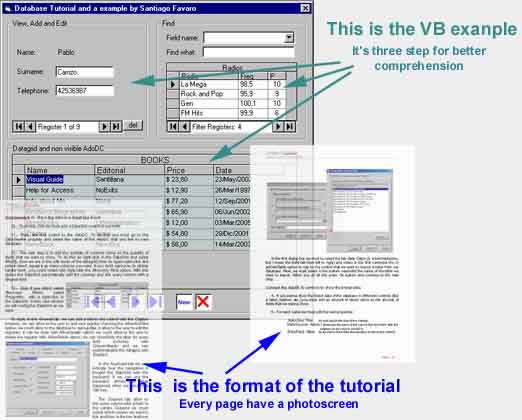

<div align="center">

## A very useful visual guide to use databases \- Part I


</div>

### Description

It is a great visual tutorial to learn about Databases in Visual Basic.

This is the part I because i couldn't upload the zip file. Please download part II at http://www.planet-source-code.com/vb/scripts/ShowCode.asp?txtCodeId=44042&lngWId=1.

This is not a simple tutorial, it have steps by step and with every step have a photoscreen to guide you

With it you can learn:

- How to link an Access database to VB

- How to view the database in labels

- How to create, delete and edit the differents register

- How to make a filter (search engine) of strings, number and Dates

- How to resolve common problems with DB

- How to show the database in a sheet like Excel (Datagrid control)

- How you can manipulate the DB with the Ado Control invisible

- How to specify a format for a type of data like "$ 23.80" or "23/sep/2003"

- and much more...

Also have a very good example divided in VB in three parts:

1- View, add and edit DB

2- Find in DB

3- Non visible Ado Control with Datagrid control

I recomend it for beginner or newbies in DB and also for that who want to make better
 
### More Info
 


<span>             |<span>
---                |---
**Submitted On**   |2003-03-14 18:01:28
**By**             |[Santiago F\.](https://github.com/Planet-Source-Code/PSCIndex/blob/master/ByAuthor/santiago-f.md)
**Level**          |Intermediate
**User Rating**    |4.7 (242 globes from 51 users)
**Compatibility**  |VB 4\.0 \(32\-bit\), VB 5\.0, VB 6\.0
**Category**       |[Databases/ Data Access/ DAO/ ADO](https://github.com/Planet-Source-Code/PSCIndex/blob/master/ByCategory/databases-data-access-dao-ado__1-6.md)
**World**          |[Visual Basic](https://github.com/Planet-Source-Code/PSCIndex/blob/master/ByWorld/visual-basic.md)
**Archive File**   |[A\_very\_use1560233152003\.zip](https://github.com/Planet-Source-Code/santiago-f-a-very-useful-visual-guide-to-use-databases-part-i__1-44040/archive/master.zip)


### Source Code

```
Please donwload the zip. It have the tutorial in Word and the example for VB.
If you found this example or the tutorial think that i worked hard in it for you and please vote me.
Part II is here: http://www.planet-source-code.com/vb/scripts/ShowCode.asp?txtCodeId=44042&lngWId=1
```

